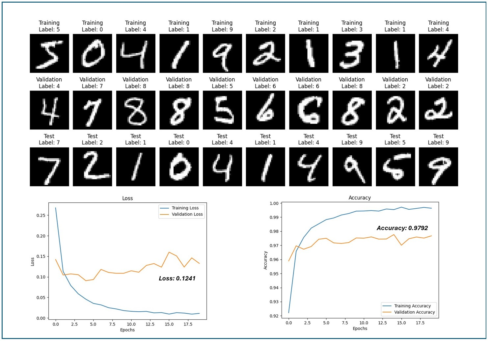

**MNIST Handwritten Digit Classification**

This code demonstrates how to build, train, and evaluate a convolutional neural network (CNN) for classifying handwritten digits from the MNIST dataset using TensorFlow and Keras.

**1. Dependencies**

The code requires the following Python libraries:

* TensorFlow
* Keras
* Matplotlib
* NumPy

**2. Data Loading and Preprocessing**

The code begins by loading the MNIST dataset using the `tf.keras.datasets.mnist` function. This function returns two tuples:

* The first tuple contains the training data (`x_train` and `y_train`).
* The second tuple contains the test data (`x_test` and `y_test`).

The MNIST dataset consists of grayscale images of handwritten digits (0-9). Each image is 28x28 pixels. The labels (`y_train` and `y_test`) are integers representing the digit class (0-9).

The code then normalizes the pixel values of both the training and test images by dividing them by 255.0. This normalization step helps improve the training process.

**3. Training and Validation Split**

The code splits the training data into two sets: training and validation sets. The validation set is used to monitor the model's performance during training and prevent overfitting.

The `validation_split` variable controls the proportion of the training data to be used for validation. In this case, 20% of the training data is used for validation.

**4. Visualization of Sample Images**

The code utilizes the `plot_all_samples` function to visualize sample images from the training, validation, and test datasets. This function displays 10 images from each dataset in a grid format, along with their corresponding labels.

**5. Building the CNN Model**

The code defines a sequential model using the `Sequential` class from Keras. The model consists of the following layers:

* **Flatten:** This layer flattens the 28x28 pixel images into a one-dimensional vector of 784 elements.
* **Dense (128 units, ReLU activation):** This layer is a fully connected layer with 128 neurons and uses the ReLU (Rectified Linear Unit) activation function.
* **Dense (64 units, ReLU activation):** Another fully connected layer with 64 neurons and ReLU activation.
* **Dense (10 units, softmax activation):** The output layer has 10 units, corresponding to the ten digit classes (0-9). The softmax activation function ensures the output probabilities sum to 1.

**6. Model Compilation**

The code compiles the model using the `compile` method. The compilation process specifies the optimizer, loss function, and metrics to be used during training.

* **Optimizer:** Adam is used as the optimizer.
* **Loss function:** Sparse categorical cross-entropy is used as the loss function for multi-class classification problems.
* **Metrics:** Accuracy is used as the metric to track the model's performance.

**7. Model Training**

The code trains the model using the `fit` method. The training process involves feeding the training data (x_train and y_train) to the model in batches. The model updates its internal parameters (weights and biases) based on the calculated loss and gradients.

The `validation_data` argument is used to evaluate the model's performance on the validation set during each epoch. This helps prevent overfitting by monitoring the model's ability to generalize to unseen data.

**8. Model Evaluation**

After training, the code evaluates the model's performance on the test dataset using the `evaluate` method. This method returns the loss and accuracy values on the test data.

**9. Prediction and Classification Report**

The code makes predictions on the test data using the `predict` method. The predicted labels are obtained by taking the argmax (index of the maximum value) of the predicted probabilities for each sample.

A classification report is generated using the `classification_report` function from scikit-learn. This report provides detailed information about the model's performance, including precision, recall, F1-score, and support for each digit class.

**10. Visualization of Training Metrics**

The code utilizes the `plot_metrics` function to visualize the training and validation accuracy and loss curves over the training epochs. This visualization helps to diagnose potential issues such as underfitting or overfitting.

**Result**

  

**Note**
* The code demonstrates the essential steps involved in building, training, and evaluating a CNN model for handwritten digit classification using TensorFlow and Keras.
* This code provides a basic example of CNN for MNIST classification.

